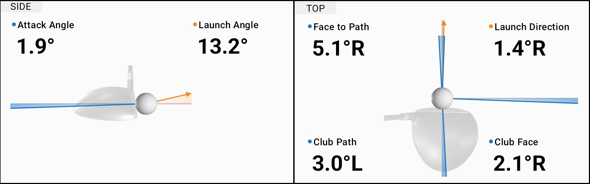

# Introduction

# Methods

## Data Cleaning

Importing our driving range data into R
```{r}
data = read.csv("data/DrivingRangeData.csv")
data = na.omit(data)
dim(data)
names(data)
```
## Dimensions and Measurments Definitions

**Index.Number:** Club "Type" + "." + Club # or Loft (drivers and wedges only). Choosing loft vs club number was arbitrarily chosen and may be changed in the future. This dimension only serves as a way to properly order clubs based on where they typically sit in a Golfer's range chart.

_Example: The driver in this data set has 9 degrees of loft, so it's Index.Number will be 1.09. Likewise, the lob wedge with 60 degrees of loft will have an Index.Number of 5.60, while the 7 iron will have an Index.Number of 4.7._

_Note: (Currently there is no indication via the index number what setting the Driver is set to for draw vs slice)_
  
| Club "Type" |   | Club "Type" # | "." | Club "#" |
|:-----------:|:-:|:-------------:|:---:|:--------:|
|   Drivers   |   |       1       |  .  |  Loft #  |
|    Woods    |   |       2       |  .  |     #    |
|   Hybrids   |   |       3       |  .  |     #    |
|    Irons    |   |       4       |  .  |     #    |
|    Wedges   |   |       5       |  .  |  Loft #  |


**Club.Name:** Commonly used name for the club e.g. Driver, 7 Iron, etc.

**Club.Speed:** The velocity (in MPH) of the club head at the moment it strikes the ball.

**Attack.Angle:** The vertical angle (in degrees) at which the club head is moving at impact, either upward (positive) or downward (negative). Typically downward for most clubs, while neutral or slightly upward for drivers and woods.

**Club.Path:** The direction the club head is moving horizontally through impact relative to the target line. This is measured in degrees, where negative is to the left, while positive is to the right.

**Club.Face:** The orientation of the club face at impact relative to the target line. This is measured in degrees, where negative is to the left, while positive is to the right.

**Face.to.Path:** The difference between the club face angle and the club path, influencing ball spin and curvature. Mathematically calculated as:

$$\text{Face to Path} = Club_{Face} - Club_{Path}$$
Here is an example image of the Side and top-down view of a club and ball at impact from Garmin's golf app visualizing these measurements:
 

 


Let's select our signal columns for use in our analysis
```{r}
shot_signals = data[data$Spin.Rate.Type == "Measured", c(
  "Index.Number",
  "Club.Name",
  "Club.Speed",
  "Attack.Angle",
  "Club.Path",
  "Club.Face",
  "Face.to.Path" # We will later show Face.to.Path's multicollinearity issues and remove it
  # May include Launch.Angle or other post-swing measurements in the future
)]

head(shot_signals)
```


Add a new chunk by clicking the *Insert Chunk* button on the toolbar or by pressing *Ctrl+Alt+I*.

When you save the notebook, an HTML file containing the code and output will be saved alongside it (click the *Preview* button or press *Ctrl+Shift+K* to preview the HTML file).

The preview shows you a rendered HTML copy of the contents of the editor. Consequently, unlike *Knit*, *Preview* does not run any R code chunks. Instead, the output of the chunk when it was last run in the editor is displayed.
