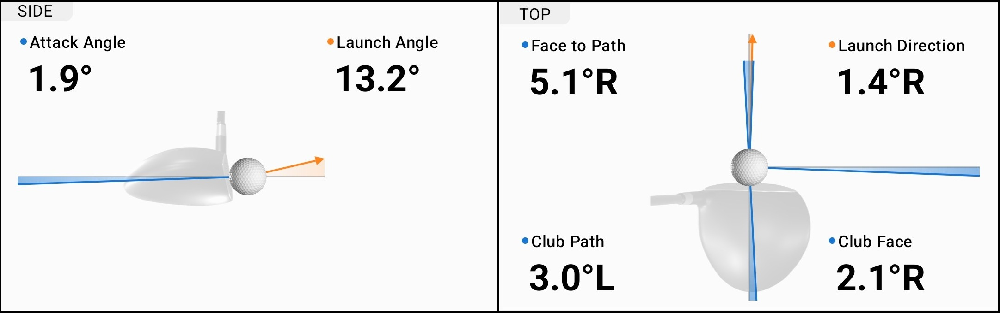

Driving Range Data Analysis
================
Tom Cox

2025-08-11

- [Introduction](#introduction)
- [Methods](#methods)
  - [Data Cleaning](#data-cleaning)
  - [Dimensions, Measurements, and
    Definitions](#dimensions-measurements-and-definitions)
  - [Defining Useful Functions](#defining-useful-functions)
  - [Data Exploration](#data-exploration)
  - [Building an Interpretable model](#building-an-interpretable-model)
- [Appendix](#appendix)
- [References](#references)

# Introduction

The pursuit of consistency is a central challenge for golfers at every
skill level. A key aspect of this is understanding not just the average
distance one hits each club, but also the factors that cause variation
in those shots. Why does one 7-iron shot fly perfectly to the target
while another lands short and 15 yards to the right?

This analysis delves into personal launch monitor data to identify the
key swing metrics that influence a golf ball’s flight and final resting
position. By examining impact data such as Club Speed, Attack Angle,
Club Path, and Club Face angle, the goal is to build a model that
explains the deviation in shot outcomes to a significant degree.

The primary objective is to quantify the effect of these input signals
on both the carry distance and the lateral deviation from the target
line (by both degrees and total distance). By understanding which
factors are most influential, a player can better focus their practice
to achieve more consistent and predictable results on the golf course.

# Methods

### Data Cleaning

First we’ll import our driving range data into R:

``` r
data = read.csv("data/DrivingRangeData.csv")
dim(data) # Size of our data set (rows and columns)
```

    ## [1] 371  31

Then remove any rows with null values from the data set:

``` r
data = na.omit(data) # Omit any rows that have missing values
dim(data) # Size of our data set after removing rows with missing values
```

    ## [1] 340  31

### Dimensions, Measurements, and Definitions

Let’s view the columns we have available for our analysis:

``` r
names(data) # Column names
```

    ##  [1] "Date"                     "Player"                  
    ##  [3] "Index.Number"             "Club.Name"               
    ##  [5] "Club.Speed"               "Attack.Angle"            
    ##  [7] "Club.Path"                "Club.Face"               
    ##  [9] "Face.to.Path"             "Ball.Speed"              
    ## [11] "Smash.Factor"             "Launch.Angle"            
    ## [13] "Launch.Direction"         "Backspin"                
    ## [15] "Sidespin"                 "Spin.Rate"               
    ## [17] "Spin.Rate.Type"           "Spin.Axis"               
    ## [19] "Apex.Height"              "Carry.Distance"          
    ## [21] "Carry.Deviation.Angle"    "Carry.Deviation.Distance"
    ## [23] "Total.Distance"           "Total.Deviation.Angle"   
    ## [25] "Total.Deviation.Distance" "Note"                    
    ## [27] "Tag"                      "Air.Density"             
    ## [29] "Temperature"              "Air.Pressure"            
    ## [31] "Relative.Humidity"

Now let’s establish definitions for the non-obvious dimensions and
measurements we’ll be using:

**Index.Number:** Club “Type” + “.” + Club \# or Loft (drivers and
wedges only). Choosing loft vs club number was arbitrarily chosen and
may be changed in the future. This dimension only serves as a way to
properly order clubs based on where they typically sit in a Golfer’s
range chart.

*Example: The driver in this data set has 9° of loft, so it’s
Index.Number will be 1.09. Likewise, the lob wedge with 60° of loft will
have an Index.Number of 5.60, while the 7 iron will have an Index.Number
of 4.7.*

*Note: (Currently there is no indication via the index number what
setting the Driver is set to for draw vs slice)*

| Club “Type” |     | Club “Type” \# | “.” | Club “\#” |
|:-----------:|:---:|:--------------:|:---:|:---------:|
|   Drivers   |     |       1        |  .  |  Loft \#  |
|    Woods    |     |       2        |  .  |    \#     |
|   Hybrids   |     |       3        |  .  |    \#     |
|    Irons    |     |       4        |  .  |    \#     |
|   Wedges    |     |       5        |  .  |  Loft \#  |

**Club.Name:** Commonly used name for the club e.g. Driver, 7 Iron, etc.

**Club.Speed:** The velocity (in MPH) of the club head at the moment it
strikes the ball.

**Attack.Angle:** The vertical angle in degrees (°) at which the club
head is moving at impact, either upward (positive) or downward
(negative). Typically downward for most clubs, while neutral or slightly
upward for drivers and woods.

**Club.Path:** The direction the club head is moving horizontally
through impact relative to the target line. This is measured in degrees
(°), where negative is to the left, while positive is to the right.

**Club.Face:** The orientation of the club face at impact relative to
the target line. This is measured in degrees (°), where negative is to
the left, while positive is to the right.

**Face.to.Path:** The difference between the club face angle and the
club path, influencing ball spin and curvature. Mathematically
calculated as:

$$\text{Face to Path} = Club_{Face} - Club_{Path}$$ Here is an example
image of the Side and top-down view of a club and ball at impact from
Garmin’s golf app visualizing these measurements:

<figure>

<figcaption aria-hidden="true"><em>Above, we can see that a Club.Face of
2.1°R (positive 2.1°) - a Club.Path of 3.0°L (negative 3.0°) equates to
a Face.to.Path of 5.1°R (positive 5.1°).</em></figcaption>
</figure>

### Defining Useful Functions

We’ll utilize several functions during our analysis to help us graph and
evaluate our models. To limit the size of this document, we’ll define
these functions in the code chunk below:

**Diagnostic Plotting Functions**

``` r
#' Plot Fitted vs. Residuals for a Model
#'
#' Creates a scatter plot of a model's fitted values against its residuals.
#' This plot is a key diagnostic tool used to check for non-linear patterns,
#' outliers, and non-constant error variance (heteroscedasticity).
#'
#' @param model A fitted model object (e.g., from `lm` or `glm`).
#' @param pointcol Character. The color for the plotted points.
#' @param linecol Character. The color for the horizontal reference line at y=0.
#' @return A scatter plot displayed in the current graphics device.
#'
plot_fitted_resid = function(model, pointcol = "dodgerblue", linecol = "darkorange") {
  model_name = deparse(substitute(model))
  plot(
    fitted(model),
    resid(model),
    col = pointcol,
    pch = 20,
    cex = 1.5,
    main = paste(model_name, "Fitted vs. Residuals"),
    xlab = "Fitted",
    ylab = "Residuals"
  )
  abline(h = 0, col = linecol, lwd = 2)
}

#' Plot Normal Q-Q Plot for Model Residuals
#'
#' Creates a Normal Quantile-Quantile (Q-Q) plot of a model's residuals.
#' This plot is used to visually assess whether the residuals follow a
#' normal distribution, which is a common assumption in linear regression.
#'
#' @param model A fitted model object (e.g., from `lm` or `glm`).
#' @param pointcol Character. The color for the points in the Q-Q plot.
#' @param linecol Character. The color for the theoretical quantile-quantile line.
#' @return A Q-Q plot displayed in the current graphics device.
#'
plot_qq = function(model, pointcol = "dodgerblue", linecol = "darkorange") {
  model_name = deparse(substitute(model))
  qqnorm(
    resid(model),
    col = pointcol,
    pch = 20,
    cex = 1.5,
    main = paste(model_name, "Normal Q-Q Plot")
  )
  qqline(resid(model), col = linecol, lwd = 2)
}

#' Create an Ordered Box Plot
#'
#' Generates a ggplot2 box plot with the correct aesthetic set-up.
#'
#' @param data The data frame containing the data.
#' @param x_var The bare (unquoted) column name for the categorical x-axis.
#' @param y_var The bare (unquoted) column name for the numeric y-axis.
#' @param orderby_var The bare (unquoted) numeric column to order the x-axis by.
#' @param title_var Character. The title for the graph
#' @param x_title Character. The x-axis title for the graph
#' @param y_title Character. The y-axis title for the graph
#'
#' @return A ggplot object.
#'
plot_boxplot = function(data, x_var, y_var, order_by_var, 
                        title_var, x_title, y_title) {
ggplot(data, aes(x = reorder({{x_var}}, {{order_by_var}}), y = {{y_var}})) +
    geom_boxplot(
      fill = "dodgerblue",
      outlier.colour = "darkorange",
      outlier.shape = 19,
      outlier.size = 2,
      staplewidth = 0.5) +
    labs(
      title = title_var,
      x = x_title,
      y = y_title
    ) +
    theme_minimal() +
    theme(axis.text.x = element_text(angle = 45, hjust = 1)) # Rotates x-axis labels for readability
}
```

**Model Results Storage**

``` r
#' Data Frame to Store and Compare Model Results
#'
#' An empty data frame structured to hold key performance metrics for one or more
#' fitted models. This allows for easy comparison of different models.
#'
#' The columns are:
#' - Model: The name of the model object.
#' - Num_Params: The total number of estimated parameters (coefficients).
#' - Predictors: A character string listing the predictor variables.
#' - AIC: Akaike Information Criterion, a measure of model fit and complexity.
#' - BIC: Bayesian Information Criterion, similar to AIC but with a larger penalty for complexity.
#' - Adj_R2: Adjusted R-squared, the proportion of variance explained, adjusted for the number of predictors.
#' - LOOCV_RMSE: Root Mean Squared Error from Leave-One-Out Cross-Validation.
#'
interpret_results_df = data.frame(
  Model = character(),
  Num_Params = integer(),
  Predictors = character(),
  AIC = numeric(),
  BIC = numeric(),
  Adj_R2 = numeric(),
  LOOCV_RMSE = numeric(),
  stringsAsFactors = FALSE
)
```

**Model Evaluation Function**

``` r
# TODO: Edit record_results to work for this model instead of old NBA one.

#' Calculate and Record Model Performance Metrics
#'
#' Extracts key performance metrics from a fitted model and appends them as a 
#' new row to a specified results data frame. It ensures that the same model is 
#' not added more than once.
#'
#' @details
#' The function calculates Leave-One-Out Cross-Validation Root Mean Squared 
#' Error (LOOCV-RMSE) using an efficient shortcut based on residuals and hat 
#' values. It also includes special logic to collapse dummy variables (e.g., 
#' from a factor like `team_abbreviation`) into a single predictor name for 
#' cleaner reporting.
#'
#' @param model A fitted model object (e.g., from `lm` or `glm`) to be evaluated.
#' @param results_df The data frame (e.g., `interpret_results_df`) to which the 
#'    results will be added.
#' @param show Logical. If `TRUE`, the calculated metrics are printed to the 
#'    console. Defaults to `FALSE`.
#' @param coef Logical. If `TRUE`, the model's coefficients summary table is 
#'    printed to the console. Defaults to `FALSE`.
#' @return A data frame with the new model's results appended as a row. If the 
#'    model name already exists in the `results_df`, the original data frame is 
#'    returned unchanged.
#'
record_results = function(model, results_df, show = F, coef = F) {
  model_name = deparse(substitute(model))
  
  # --- Calculate Metrics ---
  num_params = length(coef(model))
  aic = round(AIC(model), 3)
  bic = round(BIC(model), 3)
  adjr2 = round(summary(model)$adj.r.squared, 3)
  loocv_rmse = round(sqrt(mean((
    resid(model) / (1 - hatvalues(model))
  )^2)), 3)
  
  # --- Format Predictor Names ---
  preds_full = names(coef(model))[2:length(coef(model))] # Exclude intercept
  # Clean up dummy variable names for reporting
  if (TRUE %in% str_detect(preds_full, "team_abbreviation")) {
    preds = paste(
      c(
        'team_abbreviation', 
        preds_full[!grepl('team_abbreviation', preds_full)]
        ), 
      collapse = ' + ')
  } else {
    preds = paste(preds_full, collapse = ' + ')
  }
  
  # --- Optional Console Output ---
  if (show) {
    print(paste("Model Name:", model_name))
    print(paste("Number of Parameters:", num_params))
    print(paste("AIC:", aic))
    print(paste("BIC:", bic))
    print(paste("Adjusted R-squared:", adjr2))
    print(paste("LOOCV-RMSE:", loocv_rmse))
  }
  if (coef) {
    print(coefficients(summary(model)))
  }
  
  # --- Create Results Row ---
  result_df = data.frame(
    Model = model_name,
    Num_Params = num_params,
    Predictors = preds,
    AIC = aic,
    BIC = bic,
    Adj_R2 = adjr2,
    LOOCV_RMSE = loocv_rmse,
    stringsAsFactors = FALSE
  )
  
  # --- Append to Results Data Frame (if new) ---
  if (!(model_name %in% interpret_results_df$Model)) {
    rbind(results_df, result_df)
  } else
    results_df # Return original if model already exists
}
```

### Data Exploration

<!-- -->
<!-- -->

<!-- -->

<!-- -->

### Building an Interpretable model

For our first model, we aim to build a model that prioritizes
interpretability while maintaining decent predictive power and variation
explained by our signals. We will pursue this by keeping the model small
**TODO(ADD IN HOW SMALL? E.G. \< 4 params)** while maintaining
acceptable regression diagnostics (LINE assumptions).

Let’s select the signal columns we’ll use for our first iteration of the
model. Some of these may be removed later due to collinearity issues. We
are specifically choosing measurements that are “pre-ball flight” at
first, artificially handicapping ourselves in order to first test
whether we can achieve well-enough performing results without
post-launch data.

``` r
shot_signals = data[c(
  "Club.Name", # It's possible that Club.Name as a categorical variable could 
               # help express the loft, lie, shaft length, and any other 
               # characteristics not expressed elsewhere in the data set.
  "Club.Speed",
  "Attack.Angle",
  "Club.Path",
  "Club.Face",
  "Face.to.Path" # We will later show Face.to.Path's multicollinearity issues 
                 # and remove it.
  # We may include Launch.Angle or other post-swing measurements in the future.
)]

head(shot_signals) # First 5 rows of our signals table
```

    ##        Club.Name Club.Speed Attack.Angle Club.Path Club.Face Face.to.Path
    ## 1 Pitching Wedge     63.372         1.41     -7.37     -0.08         7.29
    ## 2 Pitching Wedge     72.812        -0.70     -0.15     -1.19        -1.04
    ## 3 Pitching Wedge     71.045         0.24     -3.23      1.13         4.36
    ## 4 Pitching Wedge     72.857         3.04     -1.58     -3.49        -1.91
    ## 5 Pitching Wedge     73.752         3.64     -2.30     -1.90         0.40
    ## 6         9 Iron     72.007         0.02     -5.10     19.43        24.53

TODO:

- Finish up data visualizations for data exploration section.

- Set up simple linear model

- Prove LINE assumptions

- Implement a geom_point graph, x = deviation, Y = carry distance
  <https://github.com/hrbrmstr/ggalt?tab=readme-ov-file#alternate-2d-density-plots>
  m \<- ggplot(faithful, aes(x = eruptions, y = waiting)) +
  geom_point() + xlim(0.5, 6) + ylim(40, 110)

  m + geom_bkde2d(bandwidth=c(0.5, 4))

# Appendix

# References
